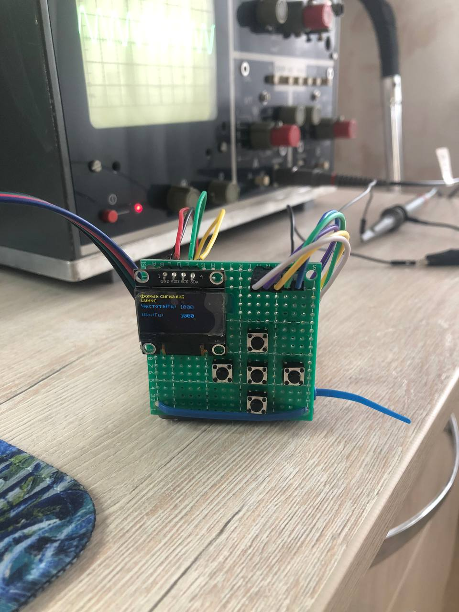
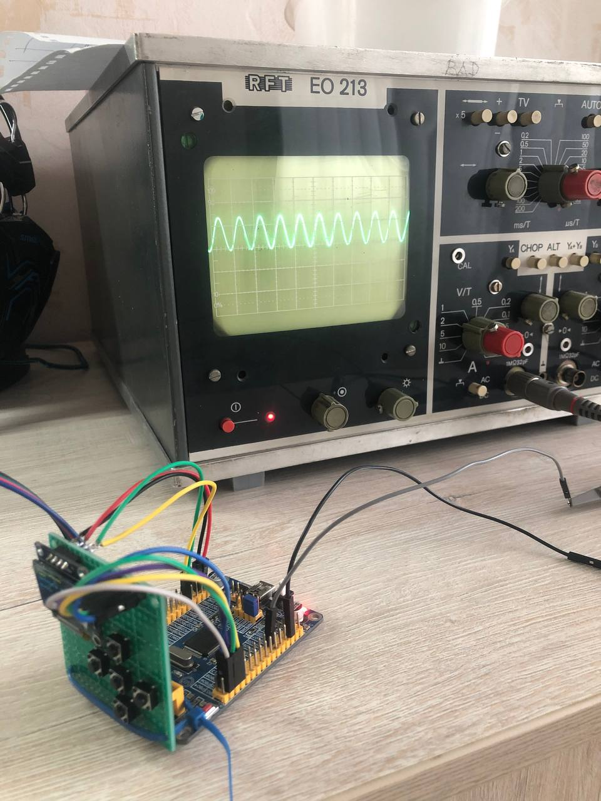

# Программа генератора сигналов

Сигналы: синус, меандр, треугольник, пила левая, пила правая.

Отсчеты сигналов брал здесь: https://progcont.ru/?articles=54&category_articles=ALL

Шаги по частоте: 125, 250, 500, 1000 Гц. Установлено верхнее ограничение 50 КГц.

Выход ЦАП: PA05.

Дисплей: OLED 128x64 I2C SSD1306 (PB10 (SCK), PB11 (SDA)). 

Для работы с дисплеем использовалась библиотека: https://github.com/StanislavLakhtin/ssd1306_libopencm3/tree/master

Управление организовано пятью кнопками в следующем расположении:
```
	^
<	*	>
	v
^ --- следующий сигнал (PB07)
v --- предыдущий сигнал (PB08)
< --- уменьшить частоту (PB05)
> --- увеличить частоту (PB06)
* --- переключить шаг (PB09)
```

